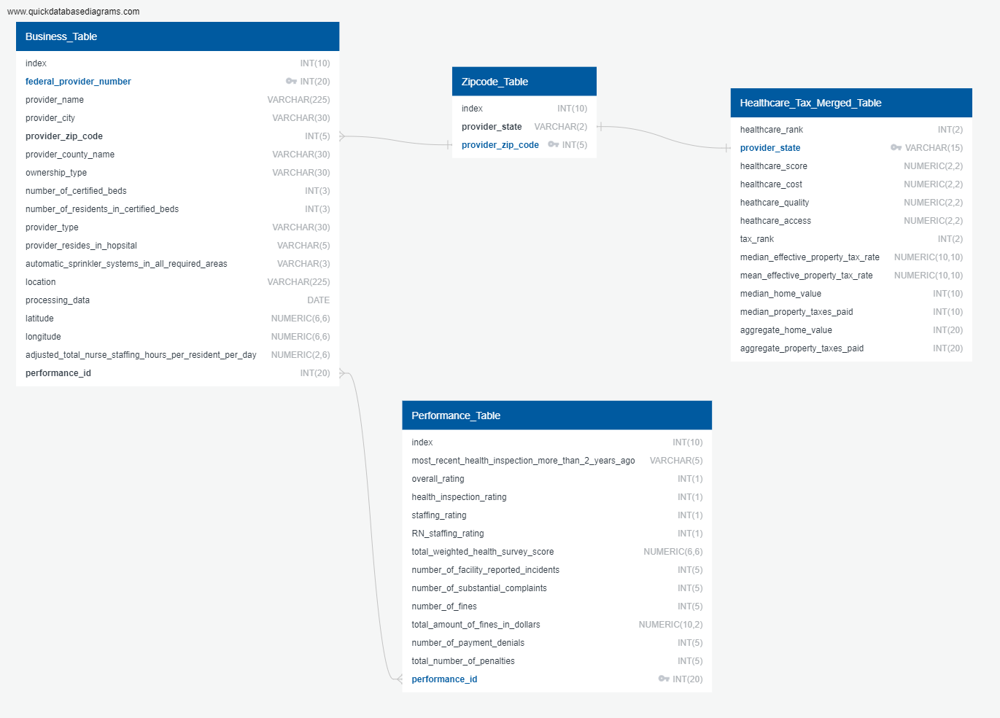

# Project 3: Best Retirement By State

## Collaborators: 
Karoly Burgyan 
Thanh Le Dinh 
Shayla Badeaux 
Maria Paula Parra 
Christian Cantu 

---
## Sources 
<ol>
    <li>Jinja (with Flask). n.d. https://palletsprojects.com/p/jinja/</li>
    <li>Nursing Home Quality and Staffing Database. https://www.kaggle.com/datasets/thedevastator/nursing-home-quality-staffing</li>
</ol>

---
## Project Outline
For Project 3, you will work with your group to tell a story using data visualizations. Here are the specific requirements:
<li>
    Your visualization must include a Python Flask-powered API, HTML/CSS, JavaScript, and at least one database (SQL, MongoDB, SQLite, etc.). 
<li>
    Your project should fall into one of the following three tracks:
</li>
 a. A combination of web scraping and Leaflet or Plotly 
 b. A dashboard page with multiple charts that update from the same data 
 c. A server that performs multiple manipulations on data in a database prior to visualization (must be approved) 
<li>
    Your project should include at least one JS library that we did not cover.
</li>
<li>
    Your project must be powered by a dataset with at least 100 records.
</li>
<li>
    Your project must include some level of user-driven interaction (e.g., menus, dropdowns, textboxes).
</li>
<li>
    Your final visualization should ideally include at least three views.
</li>
For this project, you can focus your efforts within a specific industry: Finance, Healthcare, Custom. 

## Project Question 
What are the best places to retire in each state? 

## Creating the DataFrames:
ETL for creating the 'business', 'performance',  and 'zipcode' DataFrames began by reading in raw data from .xlsx files into a general DataFrame.
<ol style='list-style-type: upper-roman;'>
    <li>
        Inspecting the data via the number of rows/columns, list of all columns present and their associated data types, and investigating any non-values if present.
    </li>
    <li>
        Dropping any duplicate rows, if any. (None were found)
    </li>
    <li>
        Adding Null to any records with non-values. 
    </li>
    <li>
        Separating the Coordinates column into separate Longitude and Latitude columns.
    </li>
    <li>
        Removing any extraneous columns and leaving only the ones necessary for our analysis.
    <li>
        Creating the three separate DataFrames from the newly cleaned DataFrame.
    </li>
    <li>
        Exporting the newly created DataFrames into CSV and JSON files for future use.
    </li>

## Creating A Database From The New .CSV Data Files:

To create a database, the CSV files were examined and an Entity-Relationship Diagram was synthesized which led to a schema. Database tables were constructed in Postgresql and, finally, these tables were populated with the data from the CSV files.
<ol style='list-style-type: upper-roman;'>
    <li>
        <strong>Inspect The .csv Files And Create The Schema And Entity-Relationship Diagram:</strong> 
        Inspecting the .csv files led to the synthesis of the following schema:   
        
            Business_Table
            --
            index INT(10)
            federal_provider_number INT(20) PK 
            provider_name VARCHAR(225)
            provider_city VARCHAR(30)
            provider_zip_code INT(5) FK >- Zipcode_Table.provider_zip_code
            provider_county_name VARCHAR(30)
            ownership_type VARCHAR(30)
            number_of_certified_beds INT(3)
            number_of_residents_in_certified_beds INT(3)
            provider_type VARCHAR(30)
            provider_resides_in_hopsital VARCHAR(5)
            automatic_sprinkler_systems_in_all_required_areas VARCHAR(3)
            location VARCHAR(225)
            processing_data DATE
            latitude NUMERIC(6,6)
            longitude NUMERIC(6,6)
            adjusted_total_nurse_staffing_hours_per_resident_per_day NUMERIC(2,6)
            performance_id INT(20) FK >-< Performance_Table.performance_id

            
            Performance_Table
            --
            index INT(10)
            most_recent_health_inspection_more_than_2_years_ago VARCHAR(5)
            overall_rating INT(1)
            health_inspection_rating INT(1)
            staffing_rating INT(1)
            RN_staffing_rating INT(1)
            total_weighted_health_survey_score NUMERIC(6,6)
            number_of_facility_reported_incidents INT(5)
            number_of_substantial_complaints INT(5)
            number_of_fines INT(5)
            total_amount_of_fines_in_dollars NUMERIC(10,2)
            number_of_payment_denials INT(5)
            total_number_of_penalties INT(5)
            performance_id INT(20) PK

                                
            Zipcode_Table
            --
            index INT(10)
            provider_state VARCHAR(2)
            provider_zip_code INT(5) PK
            
 
        which in turn led to the following ERD built in <a href="https://www.quickdatabasediagrams.com/">QuickDatabaseDiagrams.com</a>:
         
         
         
        
    </li>
     
    <li>
        <strong>Construct Database Tables:</strong> 
        The following postgresql code was run in pgAdmin4:  

        --Create Table Schema
        CREATE TABLE Zipcode_Table(
        	index INT NOT NULL,
        	provider_state VARCHAR(2) NOT NULL,
        	provider_zip_code INT PRIMARY KEY NOT NULL
        );
        
        CREATE TABLE Performance_Table(
        	index INT NOT NULL,
        	most_recent_health_inspection_more_than_2_years_ago VARCHAR(5) NOT NULL,
        	overall_rating INT NOT NULL,
        	health_inspection_rating INT NOT NULL,
        	staffing_rating INT NOT NULL,
        	RN_staffing_rating INT NOT NULL,
        	total_weighted_health_survey_score NUMERIC(6,6) NOT NULL,
        	number_of_facility_reported_incidents INT NOT NULL,
        	number_of_substantial_complaints INT NOT NULL,
        	number_of_fines INT NOT NULL,
        	total_amount_of_fines_in_dollars NUMERIC(10,2) NOT NULL,
        	number_of_payment_denials INT NOT NULL,
        	total_number_of_penalties INT NOT NULL,
        	performance_id INT NOT NULL PRIMARY KEY
        );
                          
        CREATE TABLE Business_Table (
        	index INT NOT NULL,
        	federal_provider_number INT PRIMARY KEY NOT NULL, 
        	provider_name VARCHAR(225) NOT NULL,
        	provider_city VARCHAR(30) NOT NULL,
        	provider_zip_code INT NOT NULL,
        		FOREIGN KEY (provider_zip_code) REFERENCES zipcode_table(provider_zip_code),
        	provider_county_name VARCHAR(30) NOT NULL,
        	ownership_type VARCHAR(30) NOT NULL,
        	number_of_certified_beds INT NOT NULL,
        	number_of_residents_in_certified_beds INT NOT NULL,
        	provider_type VARCHAR(30) NOT NULL,
        	provider_resides_in_hopsital VARCHAR(5) NOT NULL,
        	automatic_sprinkler_systems_in_all_required_areas VARCHAR(3) NOT NULL,
        	location VARCHAR(225) NOT NULL,
        	processing_data DATE NOT NULL,
        	latitude NUMERIC(6,6) NOT NULL,
        	longitude NUMERIC(6,6) NOT NULL,
        	adjusted_total_nurse_staffing_hours_per_resident_per_day NUMERIC(6,6) NOT NULL,
        	performance_id INT NOT NULL,
        		FOREIGN KEY (performance_id) REFERENCES performance_table(performance_id)
        );
             
    </li>

        
                
